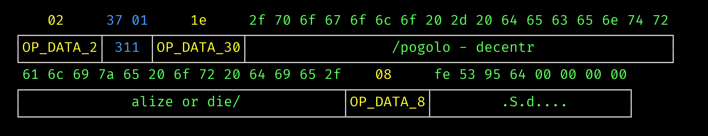

## xxbitcoin

pretty-prints various bitcoin data structures

## Usage

```
xxbitcoin --type <data structure type> <hex-encoded structure>
```
it reads from stdin if not passed a string too
```
echo <hex-encoded structure> | xxbitcoin --type <data structure type>
```



## Features
- decodes scripts, coinbase scripts, and block headers
- pretty colors :3

## Bugs
- doesnt properly chunk all strings (errors tend to be tricky)
- alignment isnt always perfect
- like zero error handling (for now)

## TODO

- [ ] decode transactions?
- [x] chunk errors (mostly works)
- [ ] error handling
- [ ] allow for different window sizes?
